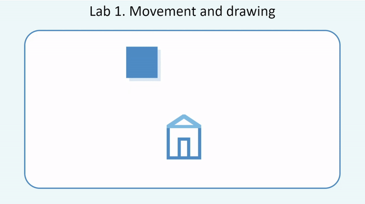
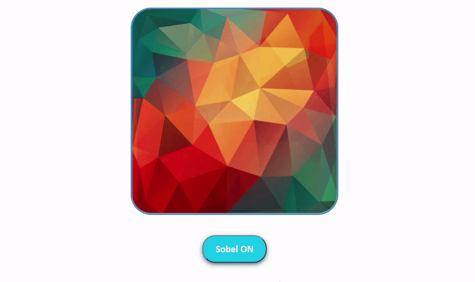
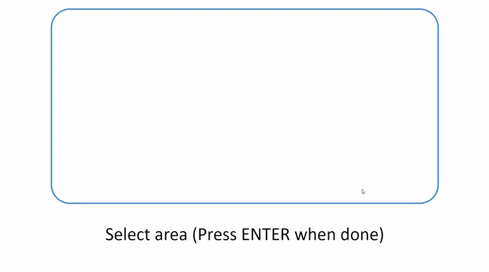
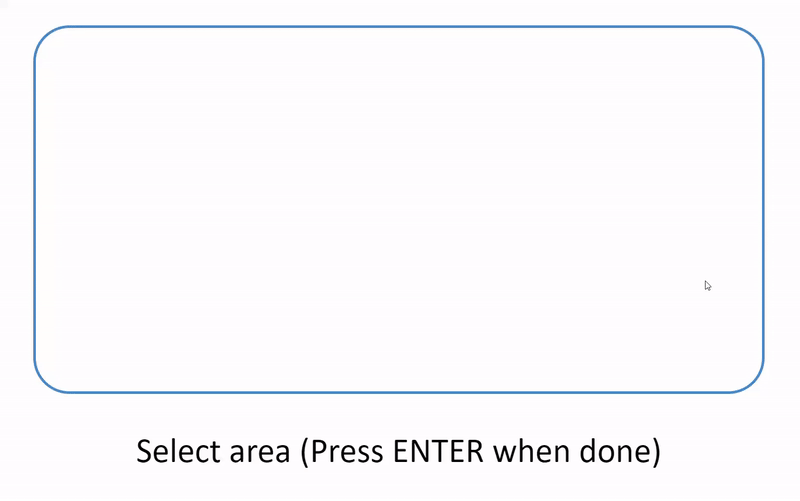
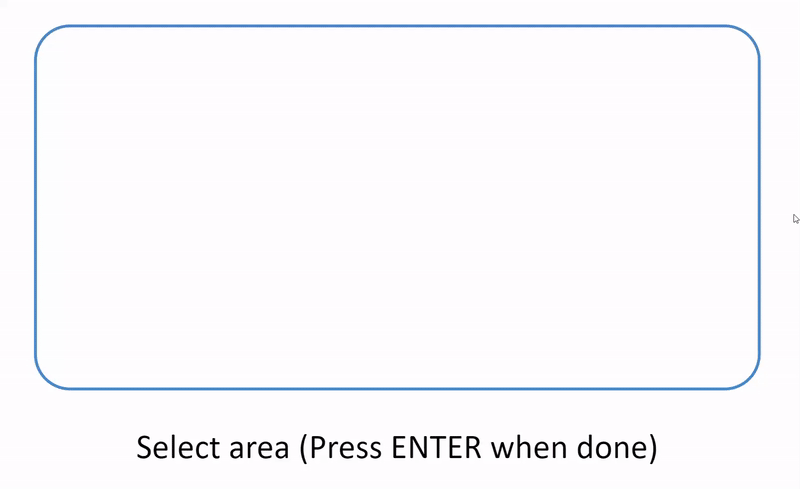

# cgraphics_labs
BMSTU labs for Computer Graphics 

## Lab 1. Movement and drawing

## Lab 2. Filtering

## Lab 3. Bresenham's algorithm

## Lab 4. Sobel filter

## Lab 5. Curus-Beck cut-off method

## Lab 6. Priming method

## Lab 7. Horizontal lines filling method 
